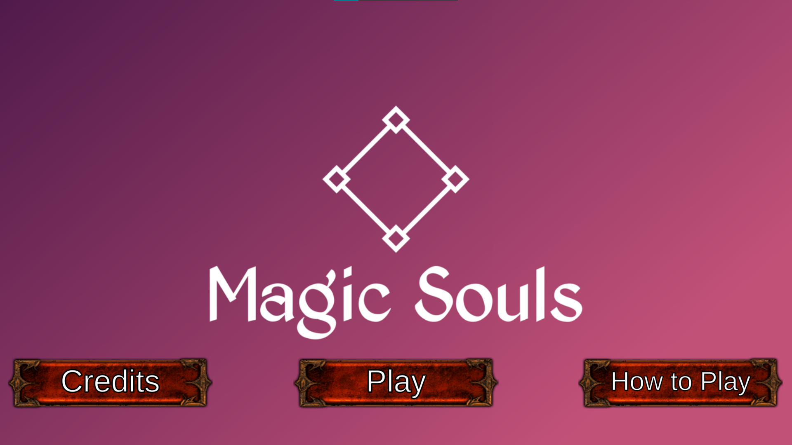
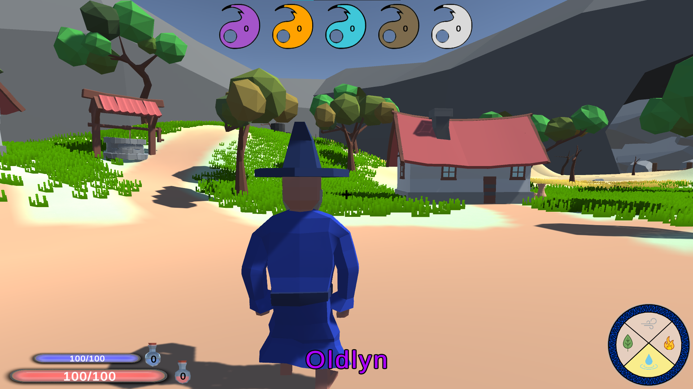
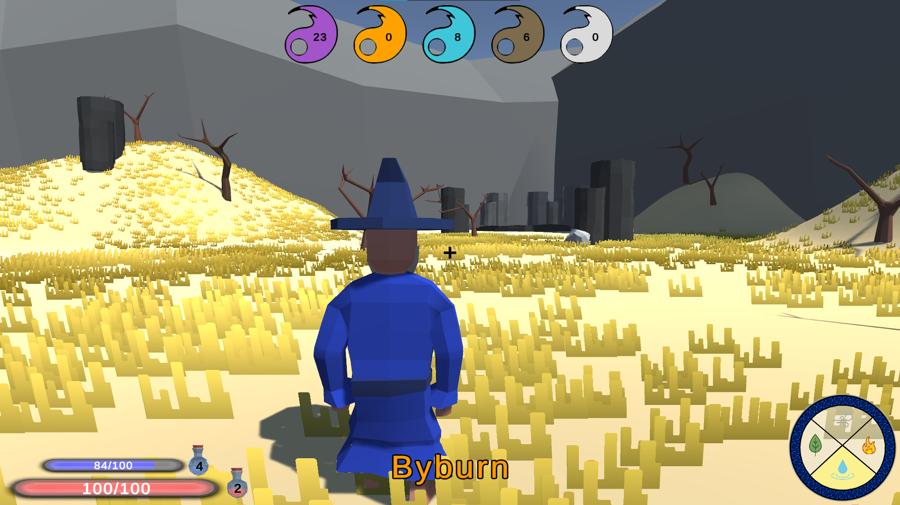
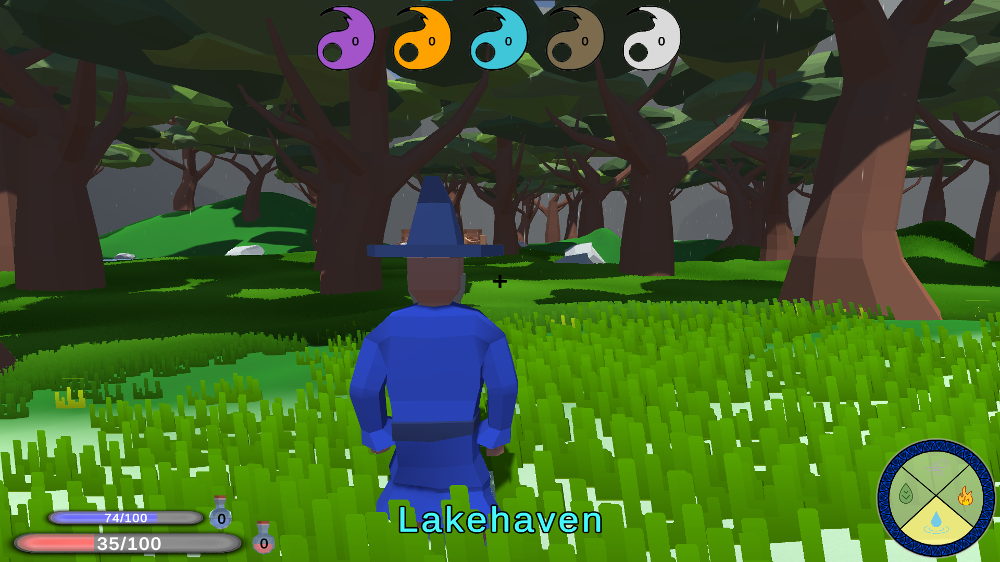
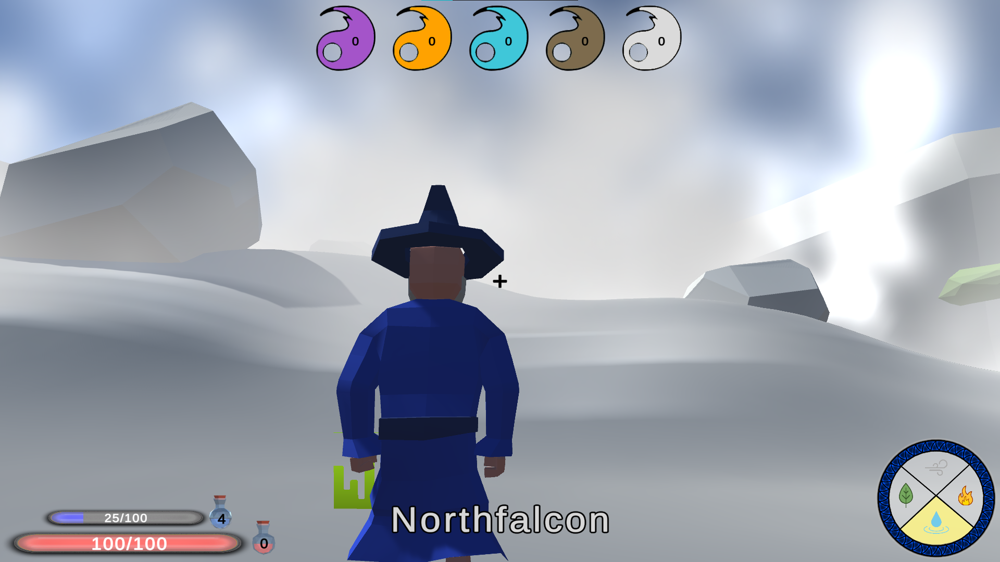
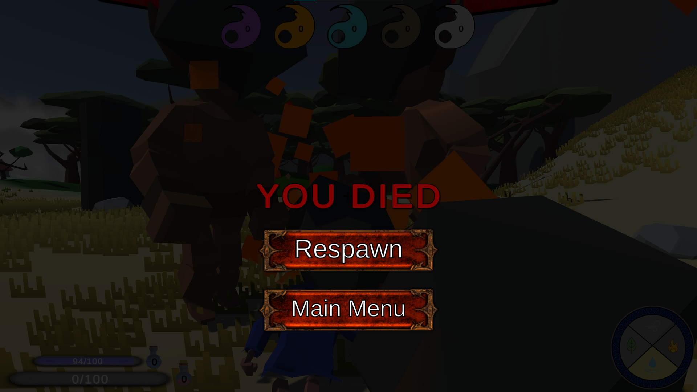

# Magic Souls

Final team project for the Computer Graphics course.

You are Garth, a retired magician from Oldlyn that has been given the task to exterminate the elemental Ethereals that have infested Fulir Valley.
In order to do so you have to collect the elemental souls of your enemies and regain the power that you lost decades ago. 
By doing so, Fulir will once again be the peaceful valley that it once was and Garth will regain his status in the magicians order.

## Screenshots
#### Main Menu

#### Oldlyn

#### Byburn

#### Lakehaven

#### Northfalcon

#### Fight enemies 

#### Don't die

## Released on itch.io!
The game has been released for free on itch.io. [Click here to download it!](https://blime.itch.io/magic-souls)
